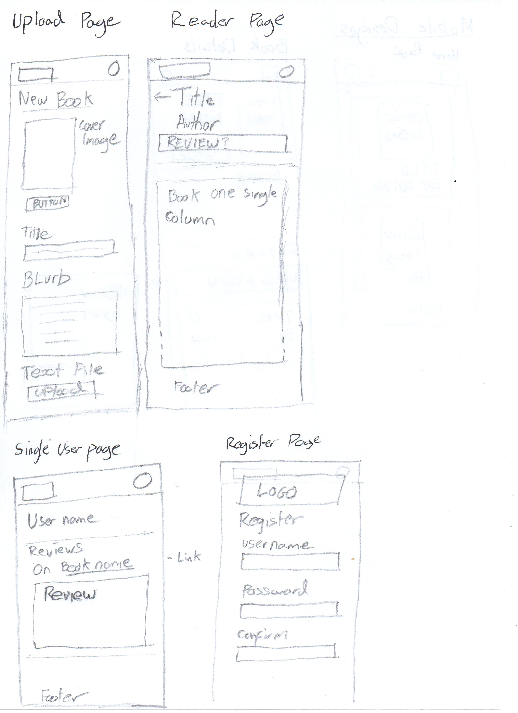
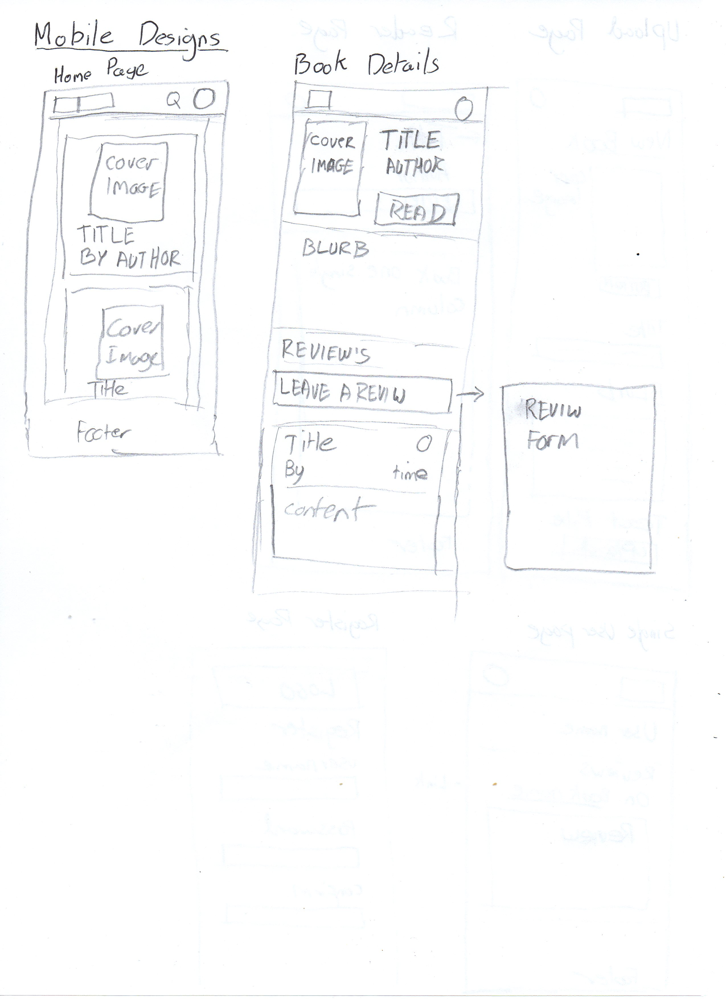

# Project Title

## Overview

My app is an E-book libary website that will store books and display them to be read. A user will be able to pick from a list of books and them select one to read. Only one person can read each book at one time.

### Problem

It is hard to find good books to read at a good price. Physical books from a libary are an improvement but can be hard to transport and you have to go to a libary in person. E-books can be easier to transport but can be expensive.

### User Profile

The users of my app will be avid readers, people on the move and others who can't or don't want to go to a physical libary but find books to expensive to read as much as they want.

### Features

- Store Ebooks on server
- View Ebooks on client
- Upload new books to the libary
- Homepage with list of all the books
- When a book is being viewed it can't be accessed by any other users (Time limit to prevent stalling?).
- Users can register and login (Auth?)
- Logged in users can borrow a book for a week
- Users can be put on a wait list for a book (Confirm within a day or book released)
- Users can review books

## Implementation

### Tech Stack

- JavaScript
- React
- SaSS
- React-router-dom
- Node.js
- Express server
- MySQL
- Knex.js

### APIs and external Data

- Project Gutenberg will be used for copyright free ebooks. This is not an API but is a download of outside books.

### Sitemap

- "/" Homepage - A grid of books each with a cover image, title and author. Also has a serch bar in the header. Book card will link to the book info.
- "/books/:id" - Book info page. Has the book title and blurb with a button to the reader. Below are the user review of the books.
- "/books/upload" - Page where users can upload books to be stored on the site
- "/reader/:id" - The reader page. Has the reader for the book displays content of the book in one long page.
- "/user/:userID" - Account page - has the account details and all of their reviews.
- "users/register" - Creates a new account

### Mockups

Provide visuals of your app's screens. You can use tools like Figma or pictures of hand-drawn sketches.

 

### Data

-1.png>)

### Endpoints

List endpoints that your server will implement, including HTTP methods, parameters, and example responses.

Books endpoints

- get "/books" gets all the book titles, authors and cover images.
- get "/books/:id" gets everything about a specific book.
- post "books" adds a new book.

User endpoints

- get "/user/:id" gets the username of that user.
- post "/user/" creates a new user.

Reveiw endpoints

- get "/reviews/:bookid" gets all the reviews for a specific book.
- post "/reviews" creates a new review
-

### Auth

Does your project include any login or user profile functionality? If so, describe how authentication/authorization will be implemented.

I will use authenticaition to have users who can reserve books and leave reviews with names. 

## Roadmap

Scope your project as a sprint. Break down the tasks that will need to be completed and map out timeframes for implementation. Think about what you can reasonably complete before the due date. The more detail you provide, the easier it will be to build.

## Nice-to-haves

- Change display details on the reader
- Filter books on genre
- Search for books
- Saves reading progress, local storage, cookies
